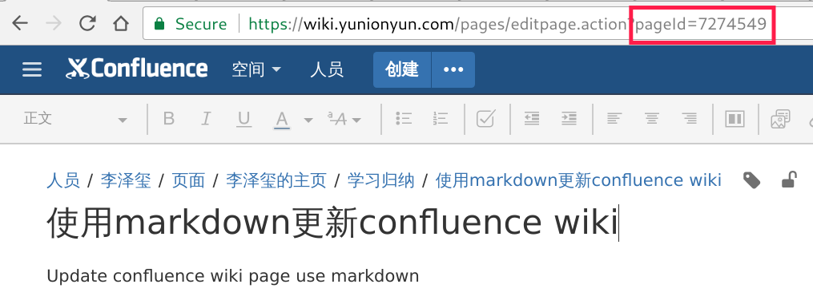

Update confluence wiki page use markdown

# Prerequisites

Use [markdown2confluence](https://github.com/chunpu/markdown2confluence) to convert markdown to confluence wiki markup, so please install it first.

```bash
$ npm i markdown2confluence -g
```

# Installation

```bash
$ go get git.yunion.io/et/md2cflc
```

# Usage

```bash
# convert markdown to confluence wiki markup content
$ md2cflc ./README.md

# update your confluence wiki page by pageid
$ md2cflc -wiki https://wiki.xxx.com -u username -p passwd -pageid 12345 ./README.md 
```

# FAQ

## How to get page id?

You can find the page id when you edit it.


